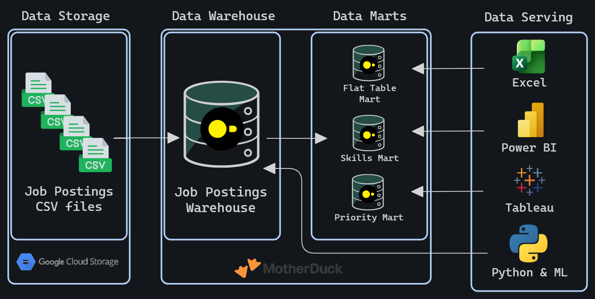

<!--
TODOs:
-->

# 🏗️ Data Warehouse &<br>🏗️ Data Marts:<br> Production ETL Pipeline Build
An End-to-end Data Engineering pipeline:
1. CSV files ->
2. Normalized Star Schema Data Warehouse (DWH) ->
3. Analytical Data Marts

 Tools:
 - CSV files: **Google Cloud Storage**
 - DWH & Data Marts: **DuckDB**

#### Access to the DWH
> The deployed DWH & Marts can be accessed in:
> 1. **MotherDuck Web UI** by running this command in your MotherDuck notebook:
> ```sql
> ATTACH 'md:_share/dw_marts/217de677-7824-4795-a8b8-ee24788567b0';
> ```
> 2. Or in your local DuckDB instance by accessing DuckDB CLI and running the above command followed by:
> ```sql
> USE data_jobs;
> ```



---

## 📜 Executive Summary
- ✅ __Pipeline Scope:__ Built __ETL pipeline__ from raw CSVs to Star Schema DWH to Analytical marts
- ✅ __Data modeling:__ Designed a __Star schema__ with fact tables, dimension, and bridge tables for many-to-many relationships
- ✅ __ETL development:__ Implemented __extract, transform, load__ processes with idempotent operations and data quality checks
- ✅ __Mart architecture:__ Created __specialized data marts__ (flat, skills, priority) with additive measures and incremental update patterns

---

## 🧩 Problem & Context

Raw job posting data arrives as flat CSV files in Google Cloud Storage — not structured for analytical queries. Analysts need to answer:

- Which skills are most in-demand over time?
- What are hiring trends by company and location?
- How do salary patterns vary by role and skill?

**Challenge:** Data teams need a single source of truth system — a DWH — to enable consistent, reliable analysis across the organization. Additionally, specialized data marts are required to optimize resources by pre-aggregating data for specific business use cases, reducing query complexity and improving performance for common analytical patterns.

**Solution:** End-to-end ETL pipeline that extracts CSVs from cloud storage, normalizes them into a star schema DWH (separating facts from dimensions), and creates specialized data marts optimized for specific use cases (flat queries, skill demand analysis, priority role tracking).  

---

## 🧰 Tech Stack
- 🦆 __Database:__ DuckDB (file-based OLAP database with GCS integration via `https`)
- 🔣 __Language:__ SQL (DDL for schema design, DML for data loading and transformation)
- 📊 __Data Model:__ Star schema (fact + dimension + bridge tables)
- 🔨 __Development:__ VS Code for SQL editing + Terminal for DuckDB CLI execution
- 🪈 __Automation:__ Master SQL script for pipeline orchestration
- 📦 __Version Control:__ Git/GitHub for versioned pipeline scripts
- ☁️ __Storage:__ Google Cloud Storage for source CSV files

---

## 📂 Repository Structure
```text
📦2_DW_Mart_Build
 ┣ 📜01_create_tables_dw.sql      # Star schema DDL
 ┣ 📜02_load_schema_dw.sql        # GCS data extraction & loading
 ┣ 📜03_create_flat_mart.sql      # Denormalized flat mart
 ┣ 📜04_create_skills_mart.sql    # Skills demand mart
 ┣ 📜05_create_priority_mart.sql  # Priority roles mart
 ┣ 📜06_update_priority_mart.sql  # Priority mart incremental update (MERGE)
 ┣ 📜build_dw_marts.sql           # Company hiring mart (optional)
 ┣ 📜dw_marts.duckdb              # Master SQL build script
 ┗ 📜README.md                    # You are here
 ```

---

## 🏗️ Pipeline Architecture

The pipeline transforms job posting CSVs from Google Cloud Storage into a normalized start schema DWH. Then builds specialized analytical data marts. BI tools (Excel, Power BI, Tableau, Python) consume from both that warehouse and marts.

---

### Data Warehouse

The DWH implements a star schema with `company_dim`, `skills_dim`, `job_postings_fact` and `skills_job_dim` tables.


- **SQL Files:**
  - [`01_create_tables_dw.sql`](./01_create_tables_dw.sql) - Defines star schema with 4 core tables.
  - [`02_load_schema_dw.sql`](./02_load_schema_dw.sql) - Extracts CSVs from GCS and loads into warehouse tables.
- **Purpose:** Star schema serving as single source of truth for analytical queries.
- **Grain:** One row per job posting in the fact table (`job_postings_fact`).

---

### Flat Mart
Denormalized table with all dimensions for ad-hoc queries.

- **SQL File:** [`03_create_flat_mart.sql`](./03_create_flat_mart.sql) - Builds denormalized table with all dimensions joined.
- **Purpose:** Denormalized table for quick ad-hoc queries.
- **Grain:** One row per job posting with all dimensions joined.

---

### Skills Mart
Time-series skill demand analysis with additive measures.


- **SQL File:** [`04_create_skills_mart.sql`](./04_create_skills_mart.sql) - Builds time-series skill demand mart.
- **Purpose:** Time-series analysis of skill demand over time with additive measures.
- **Grain:** `skill_id + month_start_date + job_title_short`.
- **Key Features:** All measures are additive (counts/sums) for safe re-aggregation.

---

### Priority Mart

Priority role tracking with incremental updates using MERGE operations.


- **SQL File:**
  - [`05_create_priority_mart.sql`](./05_create_priority_mart.sql) - Initial build of priority roles and jobs snapshot.
  - [`06_update_priority_mart.sql`](./06_update_priority_mart.sql) - Incremental update using **MERGE** (upsert pattern).
- **Purpose:** Track priority roles and job snapshots with incremental update capabilities.
- **Grain:** One row per job posting with priority levels assignment.
- **Key Features:** **MERGE operations for incremental updates** - demonstrates product-ready upsert patterns (INSERT, UPDATE, DELETE in single statement).

---

### Company Mart
Company hiring trends by role, location, and month.


- **SQL File:**
  - [`07_create_company_mart.sql`](./07_create_company_mart.sql) - Builds company hiring trends mart.
- **Purpose:** Company hiring trends analysis by role, location, and month.
- **Grain:** `company_id + job_title_short_id + location_id + month_start_date`.
- **Key Features:** Bridge tables for many-to-many relationships (company-location, job title hierarchies).

---

## 💻 Data Engineering Skills Demonstrated
### ETL Pipeline Development
- **Extract:** Direct CSV loading from Google Cloud Storage using DuckDB's `https` extension
- **Transform:** Data normalization, type conversion (`CAST`, `DATE_TRUNK`), and quality filtering
- **Load:** Idempotent table creation with `DROP TABLE IF EXISTS` patterns
- **INcremental Updates:** MERGE operations for upsert patterns (INSERT, UPDATE, DELETE in single statement)
- **Orchestration:** Master SQL script (`build_dw_marts.sql`) for automated pipeline execution

### Dimensional Modeling
- **Star Schema Design:** Fact table (`job_postings_fact`) with dimension tables (`company_dim`, `skills_dim`)
- **Bridge Tables:** Many-to-many relationship handling (`skill_job_dim`, `bridge_company_location`, `bridge_job_title`)
- **Grain Definition:** Proper fact table granularity (skill+month, company+title+location+month)
- **Additive Measures:** Counts and sums that can be safely re-aggregated at any level
- **Surrogate Keys:** Sequential ID generation using CTEs with self-joins

### SQL Advanced Techniques
- **DDL Operations:** `CREATE TABLE`, `DROP TABLE`, `CREATE SCHEMA` for schema management
- **DML Operations:** `INSERT INTO ... SELECT` with explicit column mapping from CSV
- **MERGE Operations:** Incremental updates using `MERGE INTO` with `WHEN MATCHED`, `WHEN NOT MATCHED`, and `WHEN NOT MATCHED BY SOURCE` clauses for production-ready upsert patterns
- **CTEs:** Common Table Expressions for complex transformations and boolean flag conversions
- **Date Functions:** `DATE_TRUNC('month')`, `EXTRACT(quarter)` for temporal dimension creation
- **String Functions:** `STRING_AGG` for concatenation, `REPLACE` for data cleaning
- **Boolean Logic:** `CASE WHEN` conversion for aggregating flags (remote, health insurance, no degree required)

### Data Quality & Production Practices
- **Idempotency:** All scripts safely rerunnable without side effects
- **Data validation:** Verification queries at each pipeline step to ensure data integrity
- **Type Safety:** Proper data type definitions (`VARCHAR`, `INTEGER`, `DOUBLE`, `BOOLEAN`, `TIMESTAMP`)
- **Schema Organization:** Separate schemas (`flat_mart`, `skills_mart`, `priority_mart`, `company_mart`) for logical separation
- **Error Handling:** Structured script execution with clear error messages and progress reporting